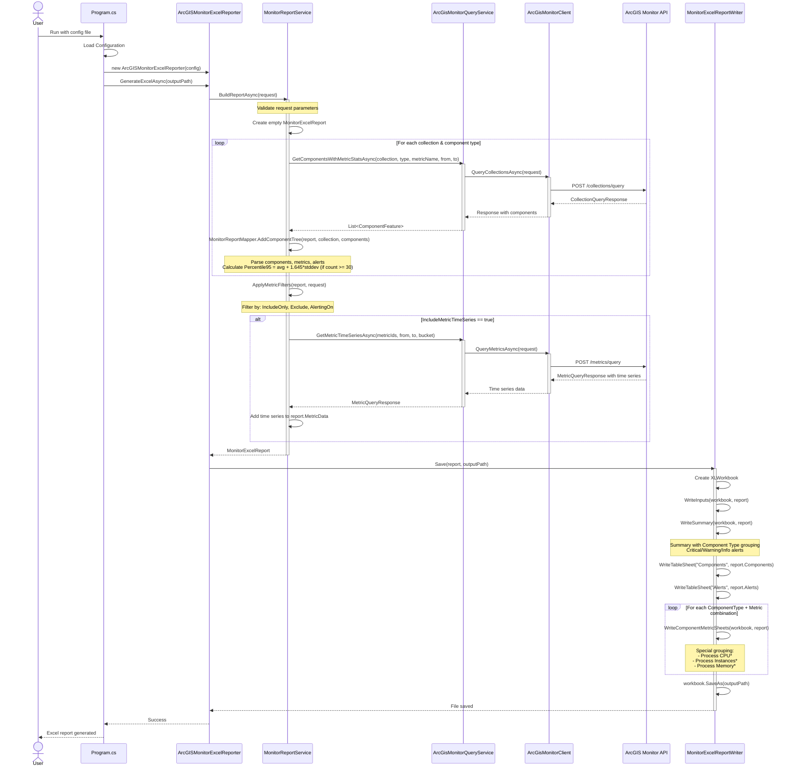
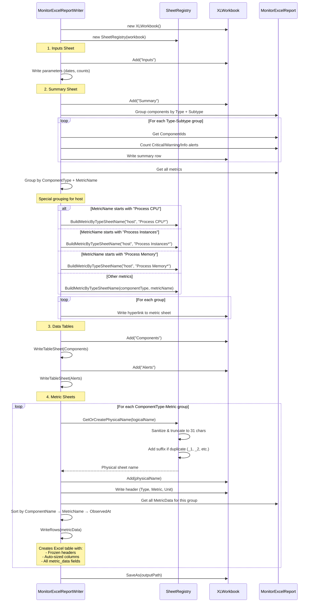
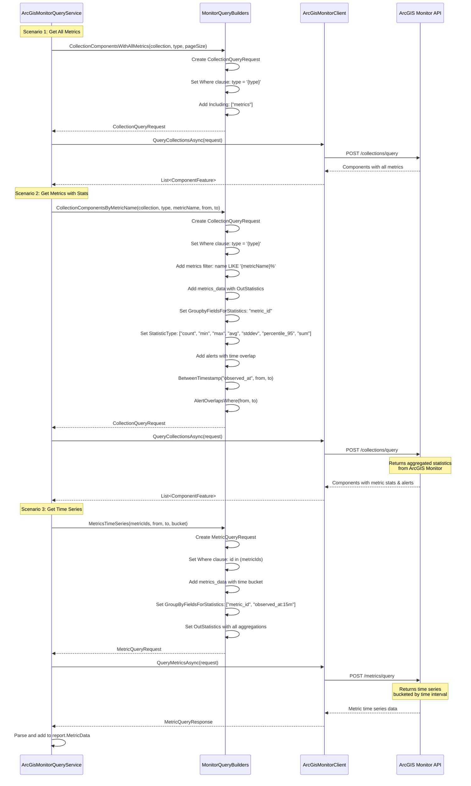

# ArcGIS Monitor Excel Reporter - Architecture Diagrams

This document provides visual diagrams of the system architecture, class relationships, and execution flows.

## Table of Contents
- [Class Diagram](#class-diagram)
- [Report Generation Sequence](#report-generation-sequence)
- [Excel Writing Sequence](#excel-writing-sequence)
- [Query Building Sequence](#query-building-sequence)

---

## Class Diagram

The following diagram shows the main classes and their relationships in the ArcGIS Monitor Excel Reporter library.

```mermaid
classDiagram
    %% Main Entry Point
    class ArcGISMonitorExcelReporter {
        -Configuration config
        -ArcGisMonitorClient client
        -ArcGisMonitorQueryService queries
        -MonitorReportService reportService
        +GenerateExcelAsync(outputPath) Task
    }

    %% Report Service Layer
    class MonitorReportService {
        -ArcGisMonitorQueryService queries
        +BuildReportAsync(request) Task~MonitorExcelReport~
        +BuildAndSaveExcelAsync(request, outputPath) Task
        -ApplyMetricFilters(report, request) void
        -ResolveCollectionName(report, metricId) string
        -MergeComponentMetrics(group) ComponentFeature
    }

    %% Query Service Layer
    class ArcGisMonitorQueryService {
        -ArcGisMonitorClient client
        +GetComponentsWithAllMetricsAsync(collection, type, pageSize) Task~List~ComponentFeature~~
        +GetComponentsWithMetricStatsAsync(collection, type, metricName, from, to, pageSize) Task~List~ComponentFeature~~
        +GetMetricTimeSeriesAsync(metricIds, from, to, bucket) Task~MetricQueryResponse~
        -PaginateAsync(query, pageSize) IAsyncEnumerable~ComponentFeature~
    }

    %% Client Layer
    class ArcGisMonitorClient {
        -HttpClient http
        -Configuration config
        +QueryCollectionsAsync(request) Task~CollectionQueryResponse~
        +QueryMetricsAsync(request) Task~MetricQueryResponse~
        +AuthenticateAsync() Task~TokenResponse~
    }

    %% Query Builders
    class MonitorQueryBuilders {
        <<static>>
        +CollectionComponents(collection, type, params) CollectionQueryRequest
        +CollectionComponentsWithAllMetrics(collection, type, params) CollectionQueryRequest
        +CollectionComponentsByMetricName(collection, type, metricName, from, to, params) CollectionQueryRequest
        +MetricsTimeSeries(metricIds, from, to, bucket) MetricQueryRequest
        +BetweenTimestamp(field, from, to) string
        +AlertOverlapsWhere(from, to) string
        +FormatMonitorTimestamp(value) string
    }

    %% Report Writer Layer
    class MonitorExcelReportWriter {
        +Save(report, outputPath) void
        -WriteInputs(workbook, registry, report) void
        -WriteSummary(workbook, registry, report) void
        -WriteComponentMetricSheets(workbook, registry, report) void
        -WriteTableSheet(workbook, registry, logicalName, rows) void
        -WriteRows(worksheet, startRow, rows) void
        -SetCellValue(cell, value) void
    }

    class SheetRegistry {
        -Dictionary~string,string~ logicalToPhysical
        -HashSet~string~ usedPhysicalNames
        +Register(logicalName, physicalName) void
        +GetOrCreatePhysicalName(logicalName) string
        +BuildMetricByTypeSheetName(componentType, metricName) string
        -SanitizeSheetNameStatic(value) string
    }

    %% Request/Response Models
    class MonitorReportRequest {
        +List~string~ CollectionNames
        +List~string~ ComponentTypes
        +List~string~ MetricNameLikes
        +List~string~ IncludeOnlyMetricNames
        +List~string~ ExcludeMetricNames
        +bool AlertingOnOnly
        +DateTimeOffset FromUtc
        +DateTimeOffset ToUtc
        +int PageSize
        +string MetricBucket
        +bool IncludeMetricTimeSeries
        +int? MaxMetricIdsForTimeSeries
    }

    class MonitorExcelReport {
        +DateTimeOffset GeneratedAtUtc
        +DateTimeOffset FromUtc
        +DateTimeOffset ToUtc
        +List~CollectionReportRow~ Collections
        +List~ComponentReportRow~ Components
        +List~MetricReportRow~ Metrics
        +List~MetricDataReportRow~ MetricData
        +List~AlertReportRow~ Alerts
    }

    class CollectionQueryRequest {
        +string Where
        +List~CollectionIncludeSpec~ Including
    }

    class MetricQueryRequest {
        +string Where
        +List~MetricIncludeSpec~ Including
    }

    %% Report Data Models
    class CollectionReportRow {
        +string CollectionName
        +string ComponentType
        +int ComponentCount
        +int MetricCount
        +int AlertCount
    }

    class ComponentReportRow {
        +string CollectionName
        +int ComponentId
        +string Name
        +string Type
        +string Subtype
        +string AddressInternal
        +string State
        +int MetricCount
        +int AlertCount
    }

    class MetricReportRow {
        +string CollectionName
        +int ComponentId
        +string ComponentName
        +string ComponentType
        +int MetricId
        +string MetricName
        +string Unit
        +bool IsAlertingEnabled
        +double InfoThreshold
        +double WarningThreshold
        +double CriticalThreshold
    }

    class MetricDataReportRow {
        +string CollectionName
        +int MetricId
        +string MetricName
        +int ComponentId
        +string ComponentName
        +DateTimeOffset ObservedAt
        +double MinValue
        +double MaxValue
        +double AvgValue
        +double StdDevValue
        +double Percentile95Value
        +double SumValue
        +double CountValue
    }

    class AlertReportRow {
        +string CollectionName
        +int AlertId
        +int MetricId
        +string MetricName
        +int ComponentId
        +string ComponentName
        +string State
        +DateTimeOffset OpenedAt
        +DateTimeOffset ClosedAt
        +double InfoThreshold
        +double WarningThreshold
        +double CriticalThreshold
    }

    %% Static Mapper
    class MonitorReportMapper {
        <<static>>
        +AddComponentTree(report, collectionName, components) void
    }

    %% Relationships
    ArcGISMonitorExcelReporter --> MonitorReportService : uses
    ArcGISMonitorExcelReporter --> ArcGisMonitorQueryService : uses
    ArcGISMonitorExcelReporter --> ArcGisMonitorClient : uses

    MonitorReportService --> ArcGisMonitorQueryService : uses
    MonitorReportService --> MonitorReportRequest : receives
    MonitorReportService --> MonitorExcelReport : produces
    MonitorReportService --> MonitorExcelReportWriter : uses

    ArcGisMonitorQueryService --> ArcGisMonitorClient : uses
    ArcGisMonitorQueryService --> MonitorQueryBuilders : uses
    ArcGisMonitorQueryService --> CollectionQueryRequest : creates
    ArcGisMonitorQueryService --> MetricQueryRequest : creates

    MonitorQueryBuilders ..> CollectionQueryRequest : creates
    MonitorQueryBuilders ..> MetricQueryRequest : creates

    MonitorExcelReportWriter --> MonitorExcelReport : reads
    MonitorExcelReportWriter --> SheetRegistry : uses

    MonitorExcelReport *-- CollectionReportRow
    MonitorExcelReport *-- ComponentReportRow
    MonitorExcelReport *-- MetricReportRow
    MonitorExcelReport *-- MetricDataReportRow
    MonitorExcelReport *-- AlertReportRow

    MonitorReportMapper ..> MonitorExcelReport : populates
```



---

## Report Generation Sequence

This sequence diagram shows the complete flow from initiating a report to saving the Excel file.



---

## Excel Writing Sequence

Detailed sequence showing how the Excel file structure is created with special metric grouping.



---

## Query Building Sequence

Shows how queries are constructed for different scenarios using the builder pattern.



---

## Key Design Patterns

### 1. **Builder Pattern**
- `MonitorQueryBuilders` provides static factory methods to construct complex queries
- Encapsulates ArcGIS Monitor query syntax (WHERE clauses, Including relationships, OutStatistics)

### 2. **Service Layer Pattern**
- `MonitorReportService` orchestrates data gathering and transformation
- `ArcGisMonitorQueryService` abstracts API communication with pagination support
- `ArcGisMonitorClient` handles low-level HTTP communication and authentication

### 3. **Mapper Pattern**
- `MonitorReportMapper` transforms ArcGIS Monitor API responses into report models
- Calculates derived values (Percentile 95 = avg + 1.645 * stddev when count ≥ 30)

### 4. **Registry Pattern**
- `SheetRegistry` manages Excel sheet naming with:
  - Name sanitization (invalid characters → `_`)
  - Truncation to 31 characters (Excel limit)
  - Duplicate detection and suffix generation (`_1`, `_2`, etc.)

### 5. **Special Grouping Logic**
For host components, process metrics are grouped with wildcards:
- `Process CPU*` → All "Process CPU - [process name]" metrics
- `Process Instances*` → All "Process Instances - [process name]" metrics
- `Process Memory*` → All "Process Memory - [process name]" metrics

This reduces the number of Excel sheets and provides a consolidated view of process metrics.

---

## Data Flow Summary

```
User Config → ArcGISMonitorExcelReporter
    ↓
MonitorReportService.BuildReportAsync()
    ↓
ArcGisMonitorQueryService (with pagination)
    ↓
ArcGisMonitorClient (HTTP + auth)
    ↓
ArcGIS Monitor REST API
    ↓
Response with Components, Metrics, Alerts, Time Series
    ↓
MonitorReportMapper.AddComponentTree()
    ↓
Calculate Percentile95 (avg + 1.645*stddev if count ≥ 30)
    ↓
Apply Filters (Include/Exclude/AlertingOn)
    ↓
MonitorExcelReport (fully populated)
    ↓
MonitorExcelReportWriter.Save()
    ↓
Excel file with:
  - Inputs sheet (parameters)
  - Summary sheet (grouped by Type+Subtype, with alert counts)
  - Components sheet (full inventory)
  - Alerts sheet (all alerts)
  - Metric sheets (one per ComponentType+Metric with wildcard grouping)
```

---

## Notes

- **Pagination**: The `ArcGisMonitorQueryService` automatically handles pagination for large result sets
- **Authentication**: Token-based authentication is managed by `ArcGisMonitorClient`
- **Statistics**: ArcGIS Monitor calculates aggregations (min, max, avg, stddev, percentile_95, sum, count)
- **Percentile 95**: Additional calculation done locally: `avg + 1.645 * stddev` when `count >= 30`
- **Error Handling**: All async operations support `CancellationToken` for graceful shutdown
- **Logging**: Comprehensive logging using Serilog throughout the pipeline

---

*Generated for ArcGIS Monitor Excel Reporter*  
*Last updated: 2025-01-27*
